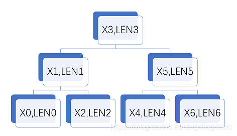
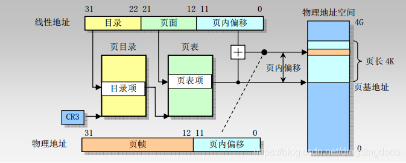
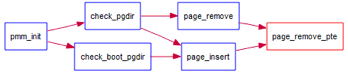
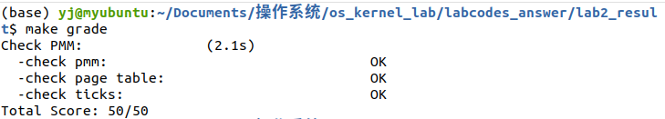
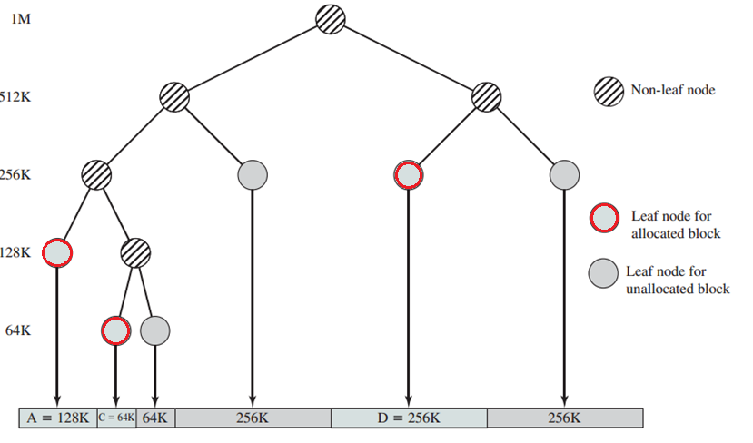
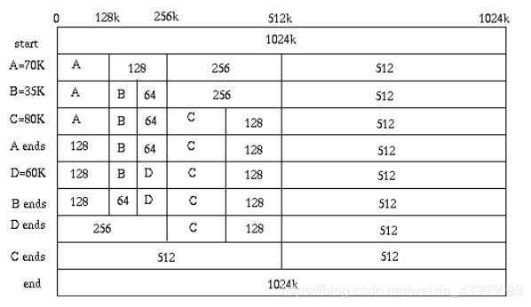
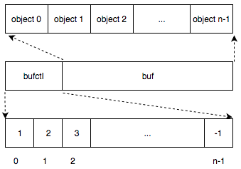

# Lab2 物理内存管理

实验一过后大家做出来了一个可以启动的系统，实验二主要涉及操作系统的物理内存管理。操作系统为了使用内存，还需高效地管理内存资源。在实验二中大家会了解并且自己动手完成一个简单的物理内存管理系统。


## 实验目的

- 理解基于段页式内存地址的转换机制
- 理解页表的建立和使用方法
- 理解物理内存的管理方法


## 实验内容

本次实验包含三个部分。

- 首先了解如何发现系统中的物理内存；
- 然后了解如何建立对物理内存的初步管理，即了解连续物理内存管理；
- 最后了解页表相关的操作，即如何建立页表来实现虚拟内存到物理内存之间的映射，对段页式内存管理机制有一个比较全面的了解。
- 本实验里面实现的内存管理还是非常基本的，并没有涉及到对实际机器的优化，比如针对 cache 的优化等。如果大家有余力，尝试完成扩展练习。


## 项目组成

表1： 实验二文件列表

```
bash
|-- boot
| |-- asm.h
| |-- bootasm.S
| \`-- bootmain.c
|-- kern
| |-- init
| | |-- entry.S
| | \`-- init.c
| |-- mm
| | |-- default\_pmm.c
| | |-- default\_pmm.h
| | |-- memlayout.h
| | |-- mmu.h
| | |-- pmm.c
| | \`-- pmm.h
| |-- sync
| | \`-- sync.h
| \`-- trap
| |-- trap.c
| |-- trapentry.S
| |-- trap.h
| \`-- vectors.S
|-- libs
| |-- atomic.h
| |-- list.h
\`-- tools
|-- kernel.ld
```

相对与实验一，实验二主要增加和修改的文件如上表所示。主要改动如下：

- boot/bootasm.S：增加了对计算机系统中物理内存布局的探测功能；

- kern/init/entry.S：根据临时段表重新暂时建立好新的段空间，为进行分页做好准备。

- kern/mm/default_pmm.[ch]：提供基本的基于链表方法的物理内存管理（分配单位为页，即4096字节）；

- kern/mm/pmm.[ch]：pmm.h定义物理内存管理类框架struct pmm_manager，基于此通用框架可以实现不同的物理内存管理策略和算法(default_pmm.[ch] 实现了一个基于此框架的简单物理内存管理策略)； pmm.c包含了对此物理内存管理类框架的访问，以及与建立、修改、访问页表相关的各种函数实现。

- kern/sync/sync.h：为确保内存管理修改相关数据时不被中断打断，提供两个功能，一个是保存eflag寄存器中的中断屏蔽位信息并屏蔽中断的功能，另一个是根据保存的中断屏蔽位信息来使能中断的功能；（可不用细看）

- libs/list.h：定义了通用双向链表结构以及相关的查找、插入等基本操作，这是建立基于链表方法的物理内存管理（以及其他内核功能）的基础。其他有类似双向链表需求的内核功能模块可直接使用list.h中定义的函数。

- libs/atomic.h：定义了对一个变量进行读写的原子操作，确保相关操作不被中断打断。（可不用细看）

- tools/kernel.ld：ld形成执行文件的地址所用到的链接脚本。修改了ucore的起始入口和代码段的起始地址。相关细节可参看附录C。

  **编译方法**

  编译并运行代码的命令如下：

  ```bash
  make
  
  make qemu
  ```

  则可以得到如下显示界面（仅供参考）

  ```bash
  chenyu$ make qemu
  (THU.CST) os is loading ...
  
  Special kernel symbols:
    entry  0xc010002c (phys)
    etext  0xc010537f (phys)
    edata  0xc01169b8 (phys)
    end    0xc01178dc (phys)
  Kernel executable memory footprint: 95KB
  memory managment: default_pmm_manager
  e820map:
    memory: 0009f400, [00000000, 0009f3ff], type = 1.
    memory: 00000c00, [0009f400, 0009ffff], type = 2.
    memory: 00010000, [000f0000, 000fffff], type = 2.
    memory: 07efd000, [00100000, 07ffcfff], type = 1.
    memory: 00003000, [07ffd000, 07ffffff], type = 2.
    memory: 00040000, [fffc0000, ffffffff], type = 2.
  check_alloc_page() succeeded!
  check_pgdir() succeeded!
  check_boot_pgdir() succeeded!
  -------------------- BEGIN --------------------
  PDE(0e0) c0000000-f8000000 38000000 urw
    |-- PTE(38000) c0000000-f8000000 38000000 -rw
  PDE(001) fac00000-fb000000 00400000 -rw
    |-- PTE(000e0) faf00000-fafe0000 000e0000 urw
    |-- PTE(00001) fafeb000-fafec000 00001000 -rw
  --------------------- END ---------------------
  ++ setup timer interrupts
  100 ticks
  100 ticks
  ……
  ```

  通过上图，我们可以看到ucore在显示其entry（入口地址）、etext（代码段截止处地址）、edata（数据段截止处地址）、和end（ucore截止处地址）的值后，探测出计算机系统中的物理内存的布局（e820map下的显示内容）。接下来ucore会以页为最小分配单位实现一个简单的内存分配管理，完成二级页表的建立，进入分页模式，执行各种我们设置的检查，最后显示ucore建立好的二级页表内容，并在分页模式下响应时钟中断。

  

## 练习

为了实现lab2的目标，lab2提供了3个基本练习和2个扩展练习，要求完成实验报告。

对实验报告的要求：

- 基于markdown格式来完成，以文本方式为主
- 填写各个基本练习中要求完成的报告内容
- 完成实验后，请分析ucore_lab中提供的参考答案，并请在实验报告中说明你的实现与参考答案的区别
- 列出你认为本实验中重要的知识点，以及与对应的OS原理中的知识点，并简要说明你对二者的含义，关系，差异等方面的理解（也可能出现实验中的知识点没有对应的原理知识点）
- 列出你认为OS原理中很重要，但在实验中没有对应上的知识点


### 练习0 

填写已有实验

本实验依赖实验1。请把你做的实验1的代码填入本实验中代码中有“LAB1”的注释相应部分。提示：可采用diff和patch工具进行半自动的合并（merge），也可用一些图形化的比较/merge工具来手动合并，比如meld，eclipse中的diff/merge工具，understand中的diff/merge工具等。

执行命令:

```bash
$ meld
```

把LAB1的自己修改的三个.c文件copy到LAB2即可

```c
kdebug.c
init.c
trap.c
```

如图 `选中`  / `Copy to Right`:


### 练习1 

实现 first-fit 连续物理内存分配算法（需要编程）

在实现first fit 内存分配算法的回收函数时，要考虑**地址连续的空闲块之间的合并操作**。提示:在建立空闲页块链表时，需要按照空闲页块起始地址来排序，形成一个有序的链表。可能会修改`default_pmm.c`中的`default_init`，`default_init_memmap`，`default_alloc_pages`， `default_free_pages`等相关函数。请仔细查看和理解`default_pmm.c`中的注释。

请在实验报告中简要说明你的设计实现过程。请回答如下问题：

- 你的first fit算法是否有进一步的改进空间


#### (1) first fit算法原理

first fit首次匹配算法原理FirstFit内存分配算法上很简单 , 在教材中有介绍:

- 处理空闲内存管理的时候, 物理内存页管理器顺着双向链表进行搜索空闲内存区域，直到找到一个足够大的空闲区域，它尽可能少地搜索链表。如果空闲区域的大小和申请分配的大小正好一样，则把这个空闲区域分配出去，成功返回；否则将该空闲区分为两部分，一部分区域与申请分配的大小相等，把它分配出去，剩下的一部分区域形成新的空闲区。其释放内存的设计思路很简单，只需把这区域重新放回双向链表中即可
- first_fit分配算法需要维护一个查找有序（地址按从小到大排列）空闲块（以页为最小单位的连续地址空间）的数据结构，双向链表是一个很好的选择。
- 首次匹配有速度优势（不需要遍历所有空闲块），但有时会让空闲列表开头的部分有很多碎片


#### (2) 关键数据结构和变量

 

在  `default_pmm.c`中定义了全局变量, 他们是free_area_t的数据成员:

```c
#define free_list (free_area.free_list)		//the list header   空闲块双向链表的头
#define nr_free (free_area.nr_free)			//the number of free pages in this free list  空闲块的总数（以页为单位）  
```

**物理页数据结构`Page`**

为了与以后的分页机制配合，我们首先需要建立对整个计算机的每一个**物理页的属性**用结构Page来表示，它包含了映射此物理页的虚拟页个数，描述物理页属性的flags和双向链接各个Page结构的page_link双向链表。物理页数据结构`Page`在`./kern/mm/memlayout.h`中定义.

```c
struct Page {
    int ref;                        // 该页被页表的引用记数
    uint32_t flags;                 // 此物理页的状态标记
    unsigned int property;          // 空闲块的数量
    list_entry_t page_link;         // 链接比它地址小和大的其他连续内存空闲块
};
```

成员变量:

1、`ref`表示该页被页表的引用记数，应该就是映射此物理页的虚拟页个数。一旦某页表中有一个页表项设置了虚拟页到这个Page管理的物理页的映射关系，就会把Page的ref加一。反之，若是解除，那就减一。
2、 `flags`表示此物理页的状态标记，有两个标志位，第一个表示是否被保留，如果被保留了则设为1（比如内核代码占用的空间）。第二个表示此页是否是free的。如果设置为1，表示这页是free的，可以被分配；如果设置为0，表示这页已经被分配出去了，不能被再二次分配。
3、`property`用来记录某连续内存空闲块的大小，这里需要注意的是用到此成员变量的这个Page一定是连续内存块的**开始地址Base**（第一页的地址）。
4、`page_link`是便于把多个连续内存空闲块链接在一起的双向链表指针，连续内存空闲块利用这个页的成员变量page_link来链接比它地址小和大的其他连续内存空闲块。

**管理连续空闲内存空间块的数据结构free_area_t**

为了有效地管理连续内存空闲块。所有的连续内存空闲块可用一个双向链表管理起来，便于分配和释放，为此定义了一个free_area_t数据结构，包含了一个list_entry结构的双向链表指针和记录当前空闲页的个数的无符号整型变量nr_free。其中的链表指针指向了空闲的物理页。

```c
typedef struct {
    list_entry_t free_list;         // 双向链表指针
    unsigned int nr_free;           // 记录当前空闲页的个数的无符号整型变量nr_free
} free_area_t;
```

成员变量:

- list_entry_t free_list: 双向链表指针
- unsigned int nr_free: 记录当前空闲页的个数的无符号整型变量nr_free

有了这两个数据结构，ucore就可以管理起来整个以页为单位的物理内存空间。接下来需要解决两个问题


#### (3) 修改函数

```
为了实现FIRST_FIT,我们需要修改如下函数:
default_init
default_init_memmap

default_alloc_pages
default_free_pages
```

**default_init双向链表和空闲块的数目初始化**

- 功能:	对free_area_t的双向链表和空闲块的数目进行初始化
- 修改:	无需修改

```c
//对free_area_t的双向链表和空闲块的数目进行初始化
static void
default_init(void) {
    list_init(&free_list);
    nr_free = 0;
}
```

**default_init_memmap**

- 功能:	初始化空闲页链表`Page`,初始化每一个空闲页，然后计算空闲页的总数

- 修改思路:    

  先传入物理页基地址和物理页的个数(个数必须大于0)，然后对每一块物理页进行设置：
  
  先判断是否为保留页，如果不是，则进行下一步。
  
  将标志位清0，连续空页个数清0，将引用此物理页的虚拟页的个数清0。
  
  最后计算空闲页的个数，修改物理基地址页的property的个数为n ，标志位置1，然后再加入空闲链表。

```c
static void
default_init_memmap(struct Page *base, size_t n) {  //基地址和物理页数量
    assert(n > 0);
    struct Page *p = base;
    for (; p != base + n; p ++) {                   //处理每一页
        assert(PageReserved(p));                    //是否为保留页
        p->flags = p->property = 0;                 //标志位清零, 空闲块数量
        set_page_ref(p, 0);                         //将引用此物理页的虚拟页的个数清0
    }
    base->property = n;                             //开头页面的空闲块数量设置为n
    SetPageProperty(base); 
    
    nr_free += n;                                   //新增空闲页个数nr_free
    list_add_before(&free_list, &(base->page_link));//将新增的Page加在双向链表指针中
}
```

**default_alloc_pages()**

- 功能:

   FIRST FIT分配, 从空闲页块的链表中去遍历，找到第一块大小大于n的块，然后分配出来，把它从空闲页链表中除去，然后如果有多余的，把分完剩下的部分再次加入会空闲页链表中

- 修改思路:

  首先判断空闲页的大小是否大于所需的页块大小。

  如果需要分配的页面数量n，已经大于了空闲页的数量，那么直接return NULL分配失败。

  过了这一个检查之后，遍历整个空闲链表。如果找到合适的空闲页，即p->property >= n（从该页开始，连续的空闲页数量大于n），即可认为可分配，重新设置标志位。具体操作是调用SetPageReserved(pp)和ClearPageProperty(pp)，设置当前页面预留，以及清空该页面的连续空闲页面数量值。

  然后从空闲链表，即free_area_t中，记录空闲页的链表，删除此项。

  如果当前空闲页的大小大于所需大小。则分割页块。具体操作就是，刚刚分配了n个页，如果分配完了，还有连续的空间，则在最后分配的那个页的下一个页（未分配），更新它的连续空闲页值。如果正好合适，则不进行操作。

  最后计算剩余空闲页个数并返回分配的页块地址。

```c
static struct Page *
default_alloc_pages(size_t n) {
    assert(n > 0);                                              
    if (n > nr_free) {                                              //检查空闲页的大小是否大于所需的页块大小
        return NULL;
    }
    struct Page *page = NULL;
    list_entry_t *le = &free_list;
    while ((le = list_next(le)) != &free_list) {                    //遍历链表找到合适的空闲页
        struct Page *p = le2page(le, page_link);
        if (p->property >= n) {                                     //第一个目标页
            page = p;
            break;
        }
    }
    if (page != NULL) {                                             //如果页的空闲块数量大于n 执行分割
        if (page->property > n) {
            struct Page *p = page + n;                              //指针后移n单位
            p->property = page->property - n;                       //数量减n
            SetPageProperty(p);                                     //调SetPageProperty设置当前页面预留
            list_add_after(&(page->page_link), &(p->page_link));    //链接被分割之后剩下的空闲块地址
        }
        list_del(&(page->page_link));                               //删除pageLink链接
        nr_free -= n;                                               //更新空闲页个数
        ClearPageProperty(page);                                    //清空该页面的连续空闲页面数量值
    }
    return page;
}
```

**default_free_pages()**

- 功能:	对页的释放操作
- 修改思路:	

首先检查基地址所在的页是否为预留，如果不是预留页，那么说明它已经是free状态，无法再次free，只有处在占用的页，才能有free操作
接着，声明一个页p，p遍历一遍整个物理空间，直到遍历到base所在位置停止，开始释放操作
找到了这个基地址之后，将空闲页重新加进来（之前在分配的时候删除），设置一系列标记位
检查合并, 如果插入基地址附近的高地址或低地址可以合并，那么需要更新相应的连续空闲页数量，向高合并和向低合并。

- 查看`memlayout.h`

```c
#define PG_reserved                 0       // 如果被内核保留, 说明不能被分配释放
#define PG_property                 1       // 只有head页需要设置property and can be used in alloc_pages
```

- 代码实现:

```c
static void
default_free_pages(struct Page *base, size_t n) {
    assert(n > 0);                  
    struct Page *p = base;
    for (; p != base + n; p ++) {                       //遍历整个物理空间
        assert(!PageReserved(p) && !PageProperty(p));   //检查是否是预留或者head页,内核保留无法分配释放, 只有PageProperty有效才是!free状态
        p->flags = 0;                                   //设置flage标志
        set_page_ref(p, 0);                             //将引用此物理页的虚拟页的个数清0, 这里类似与初始化的设置
    }
    base->property = n;                                 //设置空闲块数量
    SetPageProperty(base);                              //调SetPageProperty设置当前页面预留仅仅head
    
    list_entry_t *le = list_next(&free_list);           //新建一个管理结构,为链表头的子节点
    while (le != &free_list) {                          //遍历
        p = le2page(le, page_link);                     //新页le2page就是初始化为一个Page结构
        le = list_next(le);                             //取下一个节点

        //向高地址合并
        if (base + base->property == p) {               //如果到达当前页的尾部地址,执行合并
            base->property += p->property;              //增加头页的property
            ClearPageProperty(p);                       //清空该页面的连续空闲页面数量值
            list_del(&(p->page_link));                  //删除旧的索引
        }
        //向低地址合并
        else if (p + p->property == base) {             //同上
            p->property += base->property;              //增加头页的property
            ClearPageProperty(base);                    //clear 
            base = p;                                   //迭代交换base
            list_del(&(p->page_link));                  //删除旧的索引
        }
    }

    //检查合并结果是否发生了错误
    nr_free += n;                                       //新增空闲快数量
    le = list_next(&free_list);                         
    while (le != &free_list) {                          
        p = le2page(le, page_link);
        if (base + base->property <= p) {               //如果当前页的尾部地址小于等于p
            assert(base + base->property != p);         //检查是否不等于p
            break;
        }
        le = list_next(le);
    }
    list_add_before(le, &(base->page_link));            //将新增的Page加在双向链表指针中
}
```


#### (4) 思考

- 问题: firstfit算法能否有进一步改进的空间？

- 回答：

  有改进空间，目前算法的分配和释放都采取的是顺序表的线性遍历方法, 复杂度都是o(n)的，效率低。

  可用二叉搜索树来对内存进行管理。用二叉搜索树主要是通过对地址排序，使得在使用free时候可以在O(logn)时间内完成链表项位置的查找，从而实现时间上的优化。具体如下：
  
  

 


按照地址排序，也就是保证二叉树的任意节点的左节点的地址值小于自身地址值，右节点的地址值大于自身地址值，通过此方法优化，我们可以实现O(n)的复杂度进行内存的分配，但是可以O(logn)的复杂度进行内存的释放，因为判断合并的过程得到了优化。在这里，我们对LEN无要求，但必须保证X0<X1<X2<X3<X4<X5<X6,且地址之间无交集且不相邻。通过这个方法使得算法的复杂度得到了优化。

另外，还有一些优化连续内存处理的思路，不过需要改变First-Fit算法。如果访问的内存较多且尺寸比较小时，则可以将First-Fit改为Best-Fit会更合适。如果访问的内存较多且尺寸均为中小型尺寸时，采用Worst-Fit将更合适。

同时，采取紧缩的办法将较小的内存块合并到其他内存块，也可以使该算法得到优化，通过紧凑可以很大程度上消除外部碎片，提高空间的利用率，但实现紧凑较为复杂，在此不做赘述。


### 练习2

实现寻找虚拟地址对应的页表项（需要编程）

通过设置页表和对应的页表项，可建立虚拟内存地址和物理内存地址的对应关系。其中的`get_pte`函数是设置页表项环节中的一个重要步骤。此函数找到一个虚地址对应的二级页表项的内核虚地址，如果此二级页表项不存在，则分配一个包含此项的二级页表。本练习需要补全`get_pte`函数 `in kern/mm/pmm.c`，实现其功能。请仔细查看和理解`get_pte`函数中的注释。`get_pte`函数的调用关系图如下所示：

 

​                                                              图1 get_pte函数的调用关系图

请在实验报告中简要说明你的设计实现过程。请回答如下问题：

- 请描述页目录项（Page Directory Entry）和页表项（Page Table Entry）中每个组成部分的含义以及对ucore而言的潜在用处。
- 如果ucore执行过程中访问内存，出现了页访问异常，请问硬件要做哪些事情？


#### (1) 预备知识

**三种地址**

x86体系结构将内存地址分成三种：逻辑地址（也称虚地址）、线性地址和物理地址。

逻辑地址即是程序指令中使用的地址。

物理地址是实际访问内存的地址。

逻辑地址通过段式管理的地址映射可以得到线性地址，线性地址通过页式管理的地址映射得到物理地址。get pte函数是给出了线性地址，即linear address。

三者的关系是：线性地址（Linear Address）是逻辑地址到物理地址变换之间的中间层。程序代码会产生逻辑地址，或者说是段中的偏移地址，加上相应段的基地址就生成了一个线性地址。如果启用了分页机制，那么线性地址能再经变换以产生一个物理地址。

有时我们也把逻辑地址称为虚拟地址。因为和虚拟内存空间的概念类似，逻辑地址也是和实际物理内存容量无关的。逻辑地址和物理地址的“差距”是0xC0000000，是由于虚拟地址->线性地址->物理地址映射正好差这个值。这个值是由操作系统指定的。

本次实验相关的实现内容，主要是线性地址和物理地址，和逻辑地址基本无关，逻辑地址和线性地址的转换关系，已经在之前的函数调用中处理完毕，等到函数调用到get_pte的时候，只需要使用线性地址操作即可。


#### (2) 实现 get_pte

- 功能: 寻找虚拟地址对应的页表项, 函数找到一个虚地址对应的二级页表项的内核虚地址，如果此二级页表项不存在，则分配一个包含此项的二级页表。

- 实现思路: 

   

   

  由于我们已经具有了一个物理内存页管理器default_pmm_manager,我们就可以用它来获得所需的空闲物理页。
  在二级页表结构中,页目录表占4KB空间,ucore就可通过default_pmm_manager的default_alloc_pages函数获得一个空闲物理页,这个页的起始物理地址就是页目录表的起始地址。同理,ucore也通过这种方式获得各个页表所需的空间。页表的空间大小取决与页表要管理的物理页数n,一个页表项(32位，即4字节)可管理一个物理页,页表需要占 `n/1024`个物理页空间(向上取整)。这样页目录表和页表所占的总大小约为 4096+4∗n 字节。根据LAZY，这里我们并没有一开始就存在所有的二级页表，而是等到需要的时候再添加对应的二级页表。

  当建立从一级页表到二级页表的映射时，需要注意设置控制位。这里应该同时设置 PTE_U、PTE_W 和 PTE_P（定义可在mm/mmu.h）。

  如果原来就有二级页表，或者新建立了页表，则只需返回对应项的地址即可。

  如果原来没有二级页表，且create参数为 0，则get_pte返回NULL;如果 create参数不为 0，则 get_pte 需要申请一个新的物理页（用于存放二级页表）
  然后根据注释一步步操作，代码展示如下：
  
  ```c
  pde_t 全称为page directory entry，也就是一级页表的表项
  pte_t 全称为page table entry，表示二级页表的表项。
  uintptr_t 表示为线性地址，由于段式管理只做直接映射，所以它也是逻辑地址。
  PTE_U: 位3，表示用户态的软件可以读取对应地址的物理内存页内容
  PTE_W: 位2，表示物理内存页内容可写
  PTE_P: 位1，表示物理内存页存在
  ```
  
- 代码实现:

```c
pte_t *
get_pte(pde_t *pgdir, uintptr_t la, bool create) {
    //代码实现部分8steps
    pde_t *pdep = &pgdir[PDX(la)];                      //取出1级表项,两个过程: 1. 线性虚拟地址la >> 页目录索引 
                                                        //2.用页目录索引PDX查找页目录pgdir
    if (!(*pdep & PTE_P)) {                             //检查页目录项是否不存在或页目录项的 Present 位为0
        struct Page *page;                              //不存在则构建
        if (!create || (page = alloc_page()) == NULL) { //构建失败
            return NULL;
        }
        set_page_ref(page, 1);                          //设置引用计数, 被映射了多少次                             
        uintptr_t pa = page2pa(page);                   //取物理地址, page2ppn(page) << PGSHIFT;
        memset(KADDR(pa), 0, PGSIZE);                   //clear清零页面
        *pdep = pa | PTE_U | PTE_W | PTE_P;             //设置页目录条目的权限,
                                                        // PTE_U: 位3，表示用户态的软件可以读取对应地址的物理内存页内容
                                                        // PTE_W: 位2，表示物理内存页内容可写
                                                        // PTE_P: 位1，表示物理内存页存在
    }
    return &((pte_t *)KADDR(PDE_ADDR(*pdep)))[PTX(la)]; //拼接,返回虚拟地址, KADDR: pa >> va, PTX: la >> 页目录索引
}
```


#### (3) 描述页目录项Page Directory Entry和页表项Page Table Entry中每个组成部分的含义以及对ucore的潜在用处

- 页目录项PDE

  页目录项是指向储存页表的页面的, 所以本质上与页表项相同, 结构也应该相同. **每个页表项的高20位, 就是该页表项指向的物理页面的首地址的高20位**(当然物理页面首地址的低12位全为零), 而每个页表项的低12位, 则是一些功能位, 可以通过在mmu.h中的一组宏定义发现。

  接下来描述页目录项的每个组成部分，PDE（页目录项）的具体组成如下图所示；描述每一个组成部分的含义如下[1]：

  - 前20位表示4K对齐的该PDE对应的页表起始位置（物理地址，该物理地址的高20位即PDE中的高20位，低12位为0）；
  - 第9-11位未被CPU使用，可保留给OS使用；
  - 接下来的第8位可忽略；
  - 第7位用于设置Page大小，0表示4KB；
  - 第6位恒为0；
  - 第5位用于表示该页是否被使用过；
  - 第4位设置为1则表示不对该页进行缓存；
  - 第3位设置是否使用write through缓存写策略；
  - 第2位表示该页的访问需要的特权级；
  - 第1位表示是否允许读写；
  - 第0位为该PDE的存在位；

    

- 页表项

  接下来描述页表项（PTE）中的每个组成部分的含义，具体组成如下图所示[2]：
  
  - 高20位与PDE相似的，用于表示该PTE指向的物理页的物理地址；
  - 9-11位保留给OS使用；
  - 7-8位恒为0；
  - 第6位表示该页是否为dirty，即是否需要在swap out的时候写回外存；
  - 第5位表示是否被访问；
  - 3-4位恒为0；
  - 0-2位分别表示存在位、是否允许读写、访问该页需要的特权级；
  
   
  
- 对ucore的潜在用处

  可以发现无论是PTE还是PDE，都具有着一些保留的位供操作系统使用，也就是说ucore可以利用这些位来完成一些其他的内存管理相关的算法，比如可以在这些位里保存最近一段时间内该页的被访问的次数（仅能表示0-7次），用于辅助近似地实现虚拟内存管理中的换出策略的LRU之类的算法；也就是说这些保留位有利于OS进行功能的拓展。


#### (4) 如果ucore执行过程中访问内存，出现了页访问异常，请问硬件要做哪些事情？

产生页访问异常后，CPU把引起页访问异常的线性地址装到寄存器CR2中，ucore OS会把这个值保存在struct trapframe 中tf_err成员变量中。而中断服务例程会具体处理。

当ucore执行过程中出现了页访问异常，硬件需要完成的事情分别如下：
- CPU将发生错误的线性地址保存在CR2寄存器中, 并给出出错码errorCode，说明了页访问异常的类型；
- 在中断栈中依次压入EFLAGS, CS, EIP ，给出页访问异常码errorCode，如pagefault发生在用户态，则还需先压入ss和esp，切换到内核栈；(中断处理)
- 根据中断描述符表查询到对应page fault的ISR，跳转到对应的ISR处执行，接下来将由软件(如页访问异常处理函数do_pgfault)进行page fault处理。


### 练习3

释放某虚地址所在的页并取消对应二级页表项的映射（需要编程）

当释放一个包含某虚地址的物理内存页时，需要让对应此物理内存页的管理数据结构Page做相关的清除处理，使得此物理内存页成为空闲；另外还需把表示虚地址与物理地址对应关系的二级页表项清除。请仔细查看和理解page_remove_pte函数中的注释。为此，需要补全在 kern/mm/pmm.c中的page_remove_pte函数。page_remove_pte函数的调用关系图如下所示：



​                                                                                                       图2 page_remove_pte函数的调用关系图

请在实验报告中简要说明你的设计实现过程。请回答如下问题：

- 数据结构Page的全局变量（其实是一个数组）的每一项与页表中的页目录项和页表项有无对应关系？如果有，其对应关系是啥？
- 如果希望虚拟地址与物理地址相等，则需要如何修改lab2，完成此事？ **鼓励通过编程来具体完成这个问题**。


#### (1) 实现 page_remove_pte

- 函数功能: 释放某虚地址所在的页并取消对应二级页表项的映射

- 实现思路:

  思路主要就是先判断该页被引用的次数，如果只被引用了一次，那么直接释放掉这页, 刷新TLB, 使TLB条目无效

```c
//释放某虚地址所在的页并取消对应二级页表项的映射
static inline void
page_remove_pte(pde_t *pgdir, uintptr_t la, pte_t *ptep) {
    //具体实现
    if (*ptep & PTE_P) {                        //检查当前页表项是否存在
        struct Page *page = pte2page(*ptep);    //找到pte对应的页面
        if (page_ref_dec(page) == 0) {          //如果当前页面只被引用了0次
            free_page(page);                    //那么直接释放该页     
        }
        *ptep = 0;                              
        tlb_invalidate(pgdir, la);              //刷新TLB, 使TLB条目无效
    }
}
```


#### (2) 结果测试

- `make qemu`

 

- `make grade`

 


#### (3) 数据结构Page的全局变量（其实是一个数组）的每一项与页表中的页目录项和页表项有无对应关系？如果有，其对应关系是啥？

```
存在对应关系：当页目录项或页表项有效时，二者之间有对应关系。练习2的问题其实已经说明了一些情况，实际上，pages每一项记录一个物理页的信息，而每个页目录项记录一个页表的信息，每个页表项则记录一个物理页的信息。可以说，页目录项保存的物理页面地址（即某个页表）以及页表项保存的物理页面地址都对应于Page数组中的某一页。
```

 


#### (4) 如果希望虚拟地址与物理地址相等，则需要如何修改lab2，完成此事？ 鼓励通过编程来具体完成这个问题

```
由于在完全启动了ucore之后，虚拟地址和线性地址相等，都等于物理地址加上0xc0000000，如果需要虚拟地址和物理地址相等，可以考虑更新gdt，更新段映射，使得virtual address = linear address - 0xc0000000，这样的话就可以实现virtual address = physical address；
```

我们知道lab1中虚拟地址和物理地址便是相等的，而lab2我们通过多个步骤建立了虚拟地址到物理地址的映射，故如果取消该映射即可完成目标：(根据"系统执行中地址映射的四个阶段"内容进行反向完成)

- 首先将链接脚本改为 0x100000，只需要将tools/kernel.ld中的代码进行很小的修改即可：

```asm
ENTRY(kern_init)

SECTIONS {
            /* Load the kernel at this address: "." means the current address */
            . = 0x100000;         //修改这里为0x1000000即可

            .text : {
                       *(.text .stub .text.* .gnu.linkonce.t.*)
            }
```

- 并且将偏移量改为0：

```c
//在memlayout.h中将KERNBASE 0Xc0000000改为 0x0即可
#define KERNBASE   0xC0000000         //将“0xC0000000”改为“0x00000000”
//修改虚拟地址基址 减去一个 0xC0000000 就等于物理地址
```

需要注意的是，需要把开启页表关闭，否则会报错，因为页表开启时认为偏移量不为0，故会报错。此时虚拟地址等于物理地址，任务完成。


### 扩展练习

#### Challenge1

buddy system（伙伴系统）分配算法（需要编程）

Buddy System算法把系统中的可用存储空间划分为存储块(Block)来进行管理, 每个存储块的大小必须是2的n次幂(Pow(2, n)), 即1, 2, 4, 8, 16, 32, 64, 128...

- 参考[伙伴分配器的一个极简实现](http://coolshell.cn/articles/10427.html)， 在ucore中实现buddy system分配算法，要求有比较充分的测试用例说明实现的正确性，需要有设计文档。

**buddy是什么?**

buddy system，它是一种经典的内存分配算法，大名鼎鼎的Linux底层的内存管理用的就是它。这里不探讨内核这么复杂的实现，而仅仅是将该算法抽象提取出来，同时给出一份极其简洁的源码实现，以便定制扩展。

伙伴分配的实质就是一种特殊的**“分离适配”**，即将内存按2的幂进行划分，相当于分离出若干个块大小一致的空闲链表，搜索该链表并给出同需求最佳匹配的大小。

- 其优点是快速搜索合并（O(logN)时间复杂度）以及低外部碎片（最佳适配best-fit）
- 其缺点是内部碎片，因为按2的幂划分块，如果碰上66单位大小，那么必须划分128单位大小的块。但若需求本身就按2的幂分配，比如可以先分配若干个内存池，在其基础上进一步细分就很有吸引力了。


 


从练习1中可知，内存的分配函数是在`default_pmm.c`中实现的

`default_pmm.c`中各个函数的定义：

```c
const struct pmm_manager default_pmm_manager = {
    .name = "default_pmm_manager",
    .init = default_init,
    .init_memmap = default_init_memmap,
    .alloc_pages = default_alloc_pages,
    .free_pages = default_free_pages,
    .nr_free_pages = default_nr_free_pages,
    .check = default_check,
};
```

并在`pmm.c`中调用：

```c
//init_pmm_manager - initialize a pmm_manager instance
static void
init_pmm_manager(void) {
    pmm_manager = &default_pmm_manager;
    cprintf("memory management: %s\n", pmm_manager->name);
    pmm_manager->init();
}
```

所以实现buddy system时，要完成buddy.c和buddy.h：

`buddy.h`实现：(模仿`default_pmm.h`)

```c
#ifndef __KERN_MM_BUDDY_PMM_H__
#define  __KERN_MM_BUDDY_PMM_H__

#include <pmm.h>

extern const struct pmm_manager buddy_pmm_manager;

#endif /* ! __KERN_MM_DEFAULT_PMM_H__ */
```

在`buddy.c`中定义：

```c
const struct pmm_manager buddy_pmm_manager = {
    .name = "buddy_pmm_manager",
    .init = buddy_init,
    .init_memmap = buddy_init_memmap,
    .alloc_pages = buddy_alloc_pages,
    .free_pages = buddy_free_pages,
    .nr_free_pages = buddy_nr_free_pages,
    .check = buddy_check,
};
```

并将`pmm.c`修改为：

```c
static void
init_pmm_manager(void) {
    pmm_manager = &buddy_pmm_manager;
    cprintf("memory management: %s\n", pmm_manager->name);
    pmm_manager->init();
}
```

内存分配和释放示意图：

 

运行结果如下：


####　Challenge2

任意大小的内存单元slub分配算法（需要编程）

slub算法，实现两层架构的高效内存单元分配，第一层是基于页大小的内存分配，第二层是在第一层基础上实现基于任意大小的内存分配。可简化实现，能够体现其主体思想即可。

- 参考[linux的slub分配算法/](http://www.ibm.com/developerworks/cn/linux/l-cn-slub/)，在ucore中实现slub分配算法。要求有比较充分的测试用例说明实现的正确性，需要有设计文档。

> Challenges是选做，做一个就很好了。完成Challenge的同学可单独提交Challenge。完成得好的同学可获得最终考试成绩的加分。

实际上 Slub 分配算法是非常复杂的，需要考虑缓存对齐、NUMA 等非常多的问题，作为实验性质的操作系统就不考虑这些复杂因素了。简化的 Slub 算法结合了 Slab 算法和 Slub 算法的部分特征，使用了一些比较有技巧性的实现方法。具体的简化为：

- Slab 大小为一页，不允许创建大对象仓库
- 复用Page数据结构，将 Slab 元数据保存在 Page 结构体中

**数据结构**

在操作系统中经常会用到大量相同的数据对象，例如互斥锁、条件变量等等，同种数据对象的初始化方法、销毁方法、占用内存大小都是一样的，如果操作系统能够将所有的数据对象进行统一管理，可以提高内存利用率，同时也避免了反复初始化对象的开销。

**仓库**

每种对象由仓库（感觉cache在这里翻译为仓库更好）进行统一管理：

```c
struct kmem_cache_t {
    list_entry_t slabs_full;	// 全满Slab链表
    list_entry_t slabs_partial;	// 部分空闲Slab链表
    list_entry_t slabs_free;	// 全空闲Slab链表
    uint16_t objsize;		// 对象大小
    uint16_t num;			// 每个Slab保存的对象数目
    void (*ctor)(void*, struct kmem_cache_t *, size_t);	// 构造函数
    void (*dtor)(void*, struct kmem_cache_t *, size_t);	// 析构函数
    char name[CACHE_NAMELEN];	// 仓库名称
    list_entry_t cache_link;	// 仓库链表
};
```

由于限制 Slab 大小为一页，所以数据对象和每页对象数据不会超过`4096 = 2^12`，所以使用 16 位整数保存足够。然后所有的仓库链接成一个链表，方便进行遍历。

**Slab**

在上面的Buddy System中，一个物理页被分配之后，Page 结构中除了 ref 之外的成员都没有其他用处了，可以把Slab的元数据保存在这些内存中：

```c
struct slab_t {
    int ref;				// 页的引用次数（保留）
    struct kmem_cache_t *cachep;	// 仓库对象指针
    uint16_t inuse;			// 已经分配对象数目
    int16_t free;			// 下一个空闲对象偏移量
    list_entry_t slab_link;		// Slab链表
};
```

为了方便空闲区域的管理，Slab 对应的内存页分为两部分：保存空闲信息的 bufcnt 以及可用内存区域 buf。



对象数据不会超过2048，所以 bufctl 中每个条目为 16 位整数。bufctl 中每个“格子”都对应着一个对象内存区域，不难发现，bufctl 保存的是一个隐式链表，格子中保存的内容就是下一个空闲区域的偏移，-1 表示不存在更多空闲区，slab_t 中的 free 就是链表头部。

**内置仓库**

除了可以自行管理仓库之外，操作系统往往也提供了一些常见大小的仓库，本文实现中内置了 8 个仓库，仓库对象大小为：8B、16B、32B、64B、128B、256B、512B、1024B。

**操作函数**

**私有函数**

- `void *kmem_cache_grow(struct kmem_cache_t *cachep);`

申请一页内存，初始化空闲链表 bufctl，构造 buf 中的对象，更新 Slab 元数据，最后将新的 Slab 加入到仓库的空闲Slab表中。

- `void kmem_slab_destroy(struct kmem_cache_t *cachep, struct slab_t *slab);`

析构 buf 中的对象后将内存页归还。

**公共函数**

- `void kmem_int();`

**初始化 kmem_cache_t 仓库**：由于 kmem_cache_t 也是由 Slab 算法分配的，所以需要预先手动初始化一个kmem_cache_t 仓库；

**初始化内置仓库**：初始化 8 个固定大小的内置仓库。

- `kmem_cache_create(const char *name, size_t size, void (*ctor)(void*, struct kmem_cache_t *, size_t),void (*dtor)(void*, struct kmem_cache_t *, size_t));`

从 kmem_cache_t 仓库中获得一个对象，初始化成员，最后将对象加入仓库链表。其中需要注意的就是计算 Slab 中对象的数目，由于空闲表每一项占用 2 字节，所以每个 Slab 的对象数目就是：4096 字节/(2字节+对象大小)。

- `void kmem_cache_destroy(struct kmem_cache_t *cachep);`

释放仓库中所有的 Slab，释放 kmem_cache_t。

- `void *kmem_cache_alloc(struct kmem_cache_t *cachep);`

先查找 slabs_partial，如果没找到空闲区域则查找 slabs_free，还是没找到就申请一个新的 slab。从 slab 分配一个对象后，如果 slab 变满，那么将 slab 加入 slabs_full。

- `void *kmem_cache_zalloc(struct kmem_cache_t *cachep);`

使用 kmem_cache_alloc 分配一个对象之后将对象内存区域初始化为零。

- `void kmem_cache_free(struct kmem_cache_t *cachep, void *objp);`

将对象从 Slab 中释放，也就是将对象空间加入空闲链表，更新 Slab 元信息。如果 Slab 变空，那么将 Slab 加入slabs_partial 链表。

- `size_t kmem_cache_size(struct kmem_cache_t *cachep);`

获得仓库中对象的大小。

- `const char *kmem_cache_name(struct kmem_cache_t *cachep);`

获得仓库的名称。

- `int kmem_cache_shrink(struct kmem_cache_t *cachep);`

将仓库中 slabs_free 中所有 Slab 释放。

- `int kmem_cache_reap();`

遍历仓库链表，对每一个仓库进行 kmem_cache_shrink 操作。

- `void *kmalloc(size_t size);`

找到大小最合适的内置仓库，申请一个对象。

- `void kfree(const void *objp);`

释放内置仓库对象。

- `size_t ksize(const void *objp);`

获得仓库对象大小。


## 总结 

### 寄存器

- CR0 是系统内的控制寄存器之一。控制寄存器是一些特殊的寄存器，它们可以控制CPU的一些重要特性。

  0位是保护允许位PE(Protedted Enable)，用于启动保护模式，如果PE位置1，则保护模式启动，如果PE=0，则在实模式下运行。

  1 位是监控协处理位MP(Moniter coprocessor)，它与第3位一起决定：当TS=1时操作码WAIT是否产生一个“协处理器不能使用”的出错信号。第3位是任务转	换位(Task Switch)，当一个任务转换完成之后，自动将它置1。随着TS=1，就不能使用协处理器。

  CR0的第2位是模拟协处理器位 EM (Emulate coprocessor)，如果EM=1，则不能使用协处理器，如果EM=0，则允许使用协处理器。
  第4位是微处理器的扩展类型位 ET(Processor Extension Type)，其内保存着处理器扩展类型的信息，如果ET=0，则标识系统使用的是287协处理器，如果 ET=1，则表示系统使用的是387浮点协处理器。
  CR0的第31位是分页允许位(Paging Enable)，它表示芯片上的分页部件是否允许工作。
  CR0的第16位是写保护未即WP位(486系列之后)，只要将这一位置0就可以禁用写保护，置1则可将其恢复。

- CR1是未定义的控制寄存器，供将来的处理器使用。

- CR2是页故障线性地址寄存器，保存最后一次出现页故障的32位线性地址。

- CR3是页目录基址寄存器，保存页目录表的物理地址，页目录表总是放在以4K字节为单位的存储器边界上，因此，它的地址的低12位总为0，不起作用，即使写上内容，也不会被理会。

- CR4在Pentium系列（包括486的后期版本）处理器中才实现，它处理的事务包括诸如何时启用虚拟8086模式等。

   这几个寄存器是与分页机制密切相关的，因此，在进程管理及虚拟内存管理中会涉及到这几个寄存器，读者要记住这些寄存器的内容。


## 实验心得

这次实验是在lab1的基础上进行的，没有lab1的代码，lab2的编译是无法通过的，meld工具的重要性就体现出来了，通过用meld可以直接将lab1的代码复制到lab2中，十分便捷，并且提高了效率。

物理内存管理，主要是从物理内存分配和建立页表两个方面来设计实验的，首先要了解如何发现系统中的物理内存，然后了解如何对物理内存进行初步的管理，最后关于了解页表的相关操作还是有一定难度的，很多的编程代码都需要提示才能完成，并且要参考许多相关代码，对参考答案进行分析，这样才能深入理解实验内涵，通过这次实验也能深入理解段页式内存管理机制，是对原理课一个很好的补充。

练习1~3让我对操作系统的内存管理机制有了深刻的理解，比如不同的内存分配算法和页表等。

challenge我认为是比较有挑战性的，但和练习1有一定的联系，都是要完成内存的分配和释放。看了指导书中给的伙伴算法的参考链接，该文作者看起来很喜欢这个算法，但这个算法还是有一定的缺陷的，比起练习中实现的First-Fit，它的内部碎片反而变大了，而且它浪费严重，比如需要9K，必需分配16K的空间导致7K被浪费；合并的要求太过严格，只能是满足伙伴关系的块才能合并。优点则是可以较好的解决外部碎片问题，而且查询相关资料有提到伙伴算法针对大内存分配设计。

总的来说，lab2的收获还是很大，而且正如实验指导书最开始说的，lab1和lab2比较困难，但通过lab1和lab2后，对计算机原理中的中断、段页表机制、特权级等的理解会更深入。对后面的学习有很大的帮助。


## 源码

https://gitee.com/gunshi3/ucore/tree/master/Lab2


## 参考地址

- 清华xj: https://www.jianshu.com/p/abbe81dfe016

- Winter: https://blog.csdn.net/weixin_42637204/article/details/90113126
- 伙伴系统:https://www.cnblogs.com/ECJTUACM-873284962/p/11282683.html
- coding丁: https://blog.csdn.net/dingdingdodo/article/details/100622753