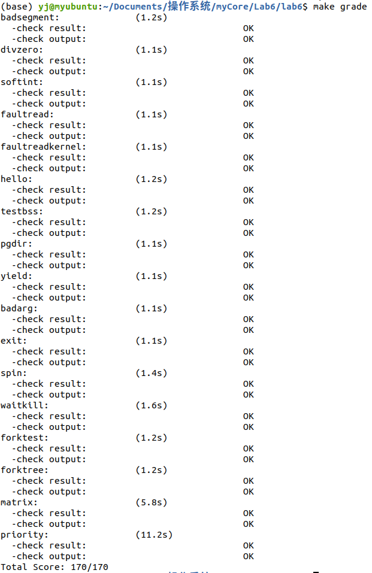
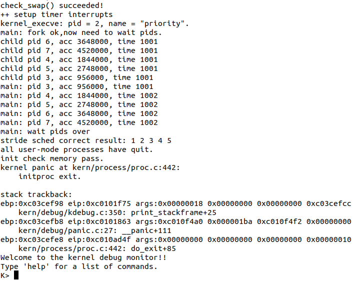
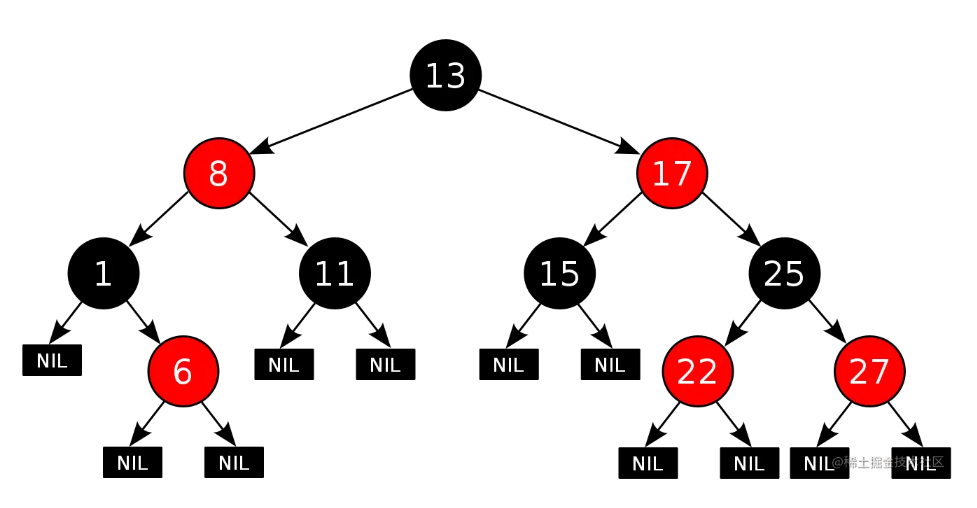

# Lab6 调度器


## 实验目的

- 理解操作系统的调度管理机制
- 熟悉 ucore 的系统调度器框架，以及缺省的Round-Robin 调度算法
- 基于调度器框架实现一个(Stride Scheduling)调度算法来替换缺省的调度算法


## 实验内容

实验五完成了用户进程的管理，可在用户态运行多个进程。但到目前为止，采用的调度策略是很简单的FIFO调度策略。本次实验，主要是熟悉ucore的系统调度器框架，以及基于此框架的Round-Robin（RR） 调度算法。然后参考RR调度算法的实现，完成Stride Scheduling调度算法。


## 项目组成

```
├── boot  
├── kern  
│ ├── debug  
│ ├── driver  
│ ├── fs  
│ ├── init  
│ ├── libs  
│ ├── mm  
│ ├── process  
│ │ ├── .....  
│ │ ├── proc.c  
│ │ ├── proc.h   
│ │ └── switch.S  
│ ├── schedule  
│ │ ├── default\_sched.c  
│ │ ├── default\_sched.h  
│ │ ├── default\_sched\_stride\_c  
│ │ ├── sched.c  
│ │ └── sched.h   
│ ├── syscall   
│ │ ├── syscall.c   
│ │ └── syscall.h  
…
```

相对与实验五，实验六主要增加的文件如上表红色部分所示，主要修改的文件如上表紫色部分所示。主要改动如下： 简单说明如下：

- libs/skew_heap.h: 提供了基本的优先队列数据结构，为本次实验提供了抽象数据结构方面的支持。

- kern/process/proc.[ch]：proc.h中扩展了proc_struct的成员变量，用于RR和stride调度算法。proc.c中实现了lab6_set_priority，用于设置进程的优先级。

- kern/schedule/{sched.h,sched.c}: 定义了 ucore 的调度器框架，其中包括相关的数据结构（包括调度器的接口和运行队列的结构），和具体的运行时机制。

- kern/schedule/{default_sched.h,default_sched.c}: 具体的 round-robin 算法，在本次实验中你需要了解其实现。

- kern/schedule/default_sched_stride_c: Stride Scheduling调度器的基本框架，在此次实验中你需要填充其中的空白部分以实现一个完整的 Stride 调度器。

- kern/syscall/syscall.[ch]: 增加了sys_gettime系统调用，便于用户进程获取当前时钟值；增加了sys_lab6_set_priority系统调用，便于用户进程设置进程优先级（给priority.c用）

- user/{matrix.c,priority.c,. . . }: 相关的一些测试用户程序，测试调度算法的正确性，user目录下包含但不限于这些程序。在完成实验过程中，建议阅读这些测试程序，以了解这些程序的行为，便于进行调试。

  

## 练习

对实验报告的要求：

- 基于markdown格式来完成，以文本方式为主
- 填写各个基本练习中要求完成的报告内容
- 完成实验后，请分析ucore_lab中提供的参考答案，并请在实验报告中说明你的实现与参考答案的区别
- 列出你认为本实验中重要的知识点，以及与对应的OS原理中的知识点，并简要说明你对二者的含义，关系，差异等方面的理解（也可能出现实验中的知识点没有对应的原理知识点）
- 列出你认为OS原理中很重要，但在实验中没有对应上的知识点


### 练习0

填写已有实验

本实验依赖实验1/2/3/4/5。请把你做的实验2/3/4/5的代码填入本实验中代码中有“LAB1”/“LAB2”/“LAB3”/“LAB4”/“LAB5”的注释相应部分。并确保编译通过。注意：为了能够正确执行lab6的测试应用程序，可能需对已完成的实验1/2/3/4/5的代码进行进一步改进。

- 与lab1～lab4类似，我们使用meld工具对代码进行合并，执行命令`meld`， 要合并的文件如下：

```c
proc.c
default_pmm.c
pmm.c
swap_fifo.c
vmm.c
trap.c
```


根据实验要求，我们需要对部分代码进行改进，对比参考答案，我做了如下改进，之后我会一一将其列举修改：

- PCT 中增加了三个与 stride 调度算法相关的成员变量，以及增加了对应的初始化过程；
- 新增了斜堆数据结构的实现；
- 新增了默认的调度算法 `Round Robin` 的实现，具体为调用 `sched_class_*` 等一系列函数之后，进一步调用调度器 `sched_class` 中封装的函数，默认该调度器为 `Round Robin` 调度器，这是在 `default_sched.*` 中定义的；
- 新增了 set_priority，get_time 的系统调用。


#### 1. proc_struct 结构体

我们在原来的实验基础上，新增了 9 行代码：

```c
int exit_code;                          //退出码(发送到父进程)
uint32_t wait_state;                    //等待状态
struct proc_struct *cptr, *yptr, *optr; //进程间的一些关系
struct run_queue *rq;                   //运行队列中包含进程
list_entry_t run_link;                  //该进程的调度链表结构，该结构内部的连接组成了 运行队列 列表
int time_slice;                         //该进程剩余的时间片，只对当前进程有效
skew_heap_entry_t lab6_run_pool;        //该进程在优先队列中的节点，仅在 LAB6 使用
uint32_t lab6_stride;                   //该进程的调度步进值，仅在 LAB6 使用
uint32_t lab6_priority;                 //该进程的调度优先级，仅在 LAB6 使用
```


#### 2. alloc_proc() 函数

我们在原来的实验基础上，新增了 6 行代码：

```c
proc->rq = NULL; //初始化运行队列为空
list_init(&(proc->run_link));//初始化运行队列的指针
proc->time_slice = 0; //初始化时间片
proc->lab6_run_pool.left = proc->lab6_run_pool.right = proc->lab6_run_pool.parent = NULL;//初始化各类指针为空，包括父进程等待
proc->lab6_stride = 0;//设置步长为0
proc->lab6_priority = 0;//设置优先级为0
```


#### 3. trap_dispatch() 函数

我们在原来的实验基础上，新增了 1 行代码：

```c
run_timer_list(); //更新定时器，并根据参数调用调度算法
```

这里主要是将时间片设置为需要调度，说明当前进程的时间片已经用完了。

所以改进后的 `trap_dispatch` 函数如下：

```c
static void trap_dispatch(struct trapframe *tf) {
    ......
    ......
    ticks ++;  
    assert(current != NULL);  
    run_timer_list(); //更新定时器，并根据参数调用调度算法  
    break;  
    ......
    ......
}
```


### 练习1

使用 Round Robin 调度算法（不需要编码）

完成练习0后，建议大家比较一下（可用kdiff3等文件比较软件）个人完成的lab5和练习0完成后的刚修改的lab6之间的区别，分析了解lab6采用RR调度算法后的执行过程。执行make grade，大部分测试用例应该通过。但执行priority.c应该过不去。

请在实验报告中完成：

- 请理解并分析sched_class中各个函数指针的用法，并结合Round Robin 调度算法描述ucore的调度执行过程；
- 请在实验报告中简要说明如何设计实现”多级反馈队列调度算法“，给出概要设计，鼓励给出详细设计。


#### 问题1

> 请理解并分析sched_class中各个函数指针的用法，并结合Round Robin 调度算法描述ucore的调度执行过程。

- RR轮转算法的思想

`Round Robin` 调度算法的调度思想是让所有 runnable 态的进程分时轮流使用 CPU 时间。`Round Robin` 调度器维护当前 runnable 进程的有序运行队列。当前进程的时间片用完之后，调度器将当前进程放置到运行队列的尾部，再从其头部取出进程进行调度。

在这个理解的基础上，我们来分析算法的具体实现。

这里 `Round Robin` 调度算法的主要实现在 `default_sched.c` 之中，现在我们来逐个函数的分析，从而了解 `Round Robin` 调度算法的原理。 

##### (1) RR_init函数

- 首先是 `RR_init` 函数，函数完成了对进程队列的初始化。


```c
//RR_init函数：这个函数被封装为 sched_class_init 函数，用于调度算法的初始化，使用grep命令可以知道，该函数仅在 ucore 入口的 init.c 里面被调用进行初始化
static void RR_init(struct run_queue *rq) { //初始化进程队列
    list_init(&(rq->run_list));//初始化运行队列
    rq->proc_num = 0;//初始化进程数为 0
}
```

- 其中的 run_queue 结构体如下：


```c
struct run_queue {
    list_entry_t run_list;//其运行队列的哨兵结构，可以看作是队列头和尾
    unsigned int proc_num;//内部进程总数
    int max_time_slice;//每个进程一轮占用的最多时间片
    // For LAB6 ONLY
    skew_heap_entry_t *lab6_run_pool;//优先队列形式的进程容器
};
```

-  `run_queue` 结构体中的 `skew_heap_entry` 结构体如下：


```c
struct skew_heap_entry {
     struct skew_heap_entry *parent, *left, *right;//树形结构的进程容器
};
typedef struct skew_heap_entry skew_heap_entry_t;
```


##### (2) RR_enqueue

入队列

然后是 `RR_enqueue` 函数，

首先，它把进程的进程控制块指针放入到 rq 队列末尾，

且如果进程控制块的时间片为 0，则需要把它重置为 `max_time_slice`。这表示如果进程在当前的执行时间片已经用完，需要等到下一次有机会运行时，才能再执行一段时间。

然后依次调整 rq 和 rq 的进程数目加一。

```c
//RR_enqueue函数：该函数的功能为将指定的进程的状态置成 RUNNABLE，并且放入调用算法中的可执行队列中，被封装成 sched_class_enqueue 函数，可以发现这个函数仅在 wakeup_proc 和 schedule 函数中被调用，前者为将某个不是 RUNNABLE 的进程加入可执行队列，而后者是将正在执行的进程换出到可执行队列中去
static void RR_enqueue(struct run_queue *rq, struct proc_struct *proc) {//将进程加入就绪队列
    assert(list_empty(&(proc->run_link)));//进程控制块指针非空
    list_add_before(&(rq->run_list), &(proc->run_link));//把进程的进程控制块指针放入到 rq 队列末尾
    if (proc->time_slice == 0 || proc->time_slice > rq->max_time_slice) {//进程控制块的时间片为 0 或者进程的时间片大于分配给进程的最大时间片
        proc->time_slice = rq->max_time_slice;//修改时间片
    }
    proc->rq = rq;//加入进程池
    rq->proc_num ++;//就绪进程数加一
}
```


##### (3) RR_dequeue 函数

出队列

然后是 `RR_dequeue` 函数，它简单的把就绪进程队列 rq 的进程控制块指针的队列元素删除，然后使就绪进程个数的proc_num减一。

```c
//RR_dequeue 函数：该函数的功能为将某个在队列中的进程取出，其封装函数 sched_class_dequeue 仅在 schedule 中被调用，表示将调度算法选择的进程从等待的可执行的进程队列中取出进行执行
static void RR_dequeue(struct run_queue *rq, struct proc_struct *proc) {//将进程从就绪队列中移除
    assert(!list_empty(&(proc->run_link)) && proc->rq == rq);//进程控制块指针非空并且进程在就绪队列中
    list_del_init(&(proc->run_link));//将进程控制块指针从就绪队列中删除
    rq->proc_num --;//就绪进程数减一
}
```


##### (4) RR_pick_next 函数

选择调度函数

接下来是 `RR_pick_next` 函数，即选取函数。它选取就绪进程队列 rq 中的队头队列元素，并把队列元素转换成进程控制块指针，即置为当前占用 CPU 的程序。

```c
//RR_pick_next 函数：该函数的封装函数同样仅在 schedule 中被调用，功能为选择要执行的下个进程
static struct proc_struct *RR_pick_next(struct run_queue *rq) {//选择下一调度进程
    list_entry_t *le = list_next(&(rq->run_list));//选取就绪进程队列 rq 中的队头队列元素
    if (le != &(rq->run_list)) {//取得就绪进程
        return le2proc(le, run_link);//返回进程控制块指针
    }
    return NULL;
}
```


##### (5) RR_proc_tick

时间片控制

最后是 `RR_proc_tick`，它每一次时间片到时的时候，当前执行进程的时间片 time_slice 便减一。如果 time_slice 降到零，则设置此进程成员变量 need_resched 标识为 1，这样在下一次中断来后执行 trap 函数时，会由于当前进程程成员变量 need_resched 标识为 1 而执行 schedule 函数，从而把当前执行进程放回就绪队列末尾，而从就绪队列头取出在就绪队列上等待时间最久的那个就绪进程执行。 

```c
//RR_proc_tick 函数：该函数表示每次时钟中断的时候应当调用的调度算法的功能，仅在进行时间中断的 ISR 中调用
static void RR_proc_tick(struct run_queue *rq, struct proc_struct *proc) {//时间片
    if (proc->time_slice > 0) {//到达时间片
        proc->time_slice --;//执行进程的时间片 time_slice 减一
    }
    if (proc->time_slice == 0) {//时间片为 0
        proc->need_resched = 1;//设置此进程成员变量 need_resched 标识为 1，进程需要调度
    }
}
```


##### (6) sched_class

`sched_class` 定义一个 c 语言类的实现，提供调度算法的切换接口。

```c
struct sched_class default_sched_class = {
    .name = "RR_scheduler",
    .init = RR_init,
    .enqueue = RR_enqueue,
    .dequeue = RR_dequeue,
    .pick_next = RR_pick_next,
    .proc_tick = RR_proc_tick,
};
```

首先我们可以查看一下 sched_class 类中的内容：

```c
struct sched_class {
  const char *name;// 调度器的名字
  void (*init) (struct run_queue *rq);// 初始化运行队列
  void (*enqueue) (struct run_queue *rq, struct proc_struct *p);// 将进程 p 插入队列 rq
  void (*dequeue) (struct run_queue *rq, struct proc_struct *p);// 将进程 p 从队列 rq 中删除
  struct proc_struct* (*pick_next) (struct run_queue *rq);// 返回运行队列中下一个可执行的进程
  void (*proc_tick)(struct run_queue* rq, struct proc_struct* p);// timetick 处理函数
};
```


##### (7) 描述 ucore 调度执行过程

接下来我们结合具体算法来描述一下 ucore 调度执行过程：

- 在ucore中调用调度器的主体函数（不包括 init，proc_tick）的代码仅存在在 wakeup_proc 和 schedule，前者的作用在于将某一个指定进程放入可执行进程队列中，后者在于将当前执行的进程放入可执行队列中，然后将队列中选择的下一个执行的进程取出执行；

- 当需要将某一个进程加入就绪进程队列中，则需要将这个进程的能够使用的时间片进行初始化，然后将其插入到使用链表组织的队列的队尾；

  这就是具体的 Round-Robin enqueue 函数的实现；

- 当需要将某一个进程从就绪队列中取出的时候，只需要将其直接删除即可；

- 当需要取出执行的下一个进程的时候，只需要将就绪队列的队头取出即可；

- 每当出现一个时钟中断，则会将当前执行的进程的剩余可执行时间减 1，一旦减到了 0，则将其标记为可以被调度的，这样在 ISR 中的后续部分就会调用 schedule 函数将这个进程切换出去；


#### 问题2

> 请在实验报告中简要说明如何设计实现”多级反馈队列调度算法“，给出概要设计，鼓励给出详细设计。

**设计如下：**

- 在 proc_struct 中添加总共 N 个多级反馈队列的入口，每个队列都有着各自的优先级，编号越大的队列优先级越低，并且优先级越低的队列上时间片的长度越大，为其上一个优先级队列的两倍；并且在 PCB 中记录当前进程所处的队列的优先级；

- 处理调度算法初始化的时候需要同时对 N 个队列进行初始化；

- 在处理将进程加入到就绪进程集合的时候，观察这个进程的时间片有没有使用完，如果使用完了，就将所在队列的优先级调低，加入到优先级低 1 级的队列中去，如果没有使用完时间片，则加入到当前优先级的队列中去；

- 在同一个优先级的队列内使用时间片轮转算法；

- 在选择下一个执行的进程的时候，有限考虑高优先级的队列中是否存在任务，如果不存在才转而寻找较低优先级的队列；（有可能导致饥饿）

- 从就绪进程集合中删除某一个进程就只需要在对应队列中删除即可；

- 处理时间中断的函数不需要改变；

**至此完成了多级反馈队列调度算法的具体设计。**


### 练习2

实现 Stride Scheduling 调度算法（需要编码）

首先需要换掉RR调度器的实现，即用default_sched_stride_c覆盖default_sched.c。然后根据此文件和后续文档对Stride调度器的相关描述，完成Stride调度算法的实现。

后面的实验文档部分给出了Stride调度算法的大体描述。这里给出Stride调度算法的一些相关的资料（目前网上中文的资料比较欠缺）。

- [strid-shed paper location1](http://wwwagss.informatik.uni-kl.de/Projekte/Squirrel/stride/node3.html)
- [strid-shed paper location2](http://citeseerx.ist.psu.edu/viewdoc/summary?doi=10.1.1.138.3502&rank=1)
- 也可GOOGLE “Stride Scheduling” 来查找相关资料

执行：make grade。如果所显示的应用程序检测都输出ok，则基本正确。如果只是priority.c过不去，可执行 make run-priority 命令来单独调试它。大致执行结果可看附录。（ 使用的是 qemu-1.0.1 ）。

请在实验报告中简要说明你的设计实现过程。

```
首先需要换掉RR调度器的实现，即用default_sched_stride_c覆盖default_sched.c。然后根据此文件和后续文档对Stride度器的相关描述，完成Stride调度算法的实现。

后面的实验文档部分给出了Stride调度算法的大体描述。这里给出Stride调度算法的一些相关的资料（目前网上中文的资料比较欠缺）。

strid-shed paper location1
strid-shed paper location2
也可GOOGLE “Stride Scheduling” 来查找相关资料
执行：make grade。如果所显示的应用程序检测都输出ok，则基本正确。如果只是priority.c过不去，可执行 make run-priority 命令来单独调试它。大致执行结果可看附录。（ 使用的是 qemu-1.0.1 ）。

请在实验报告中简要说明你的设计实现过程。
```

首先，根据实验指导书的要求，先用 default_sched_stride_c 覆盖 default_sched.c，即覆盖掉 Round Robin 调度算法的实现。 

覆盖掉之后需要在该框架上实现 Stride Scheduling 调度算法。 

关于 Stride Scheduling 调度算法，经过查阅资料和实验指导书，我们可以简单的把思想归结如下：

- 1、为每个 runnable 的进程设置一个当前状态 stride，表示该进程当前的调度权。另外定义其对应的 pass 值，表示对应进程在调度后，stride 需要进行的累加值。
- 2、每次需要调度时，从当前 runnable 态的进程中选择 stride 最小的进程调度。对于获得调度的进程 P，将对应的 stride 加上其对应的步长 pass（只与进程的优先权有关系）。
- 3、在一段固定的时间之后，回到步骤 2，重新调度当前 stride 最小的进程。


接下来针对代码我们逐步分析，首先完整代码如下：

#### (1) 实现思路 

```c
* 实现思路：
由于在 ucore 中使用面向对象编程的思想，将所有与调度算法相关的函数封装在了调度器 sched_class 中，因此其实可以不需要覆盖掉 default_sched.c，只需要将 default_sched_stride_c 改名成 default_sched_stride.c，然后注释掉 default_sched.c 中的 sched_class 的定义，这样由于 default_sched_stride.c 中也有 sched_class 的定义，其他代码在调用调度器的接口的时候就直接调用了新实现的 Stride Scheduling 算法实现的函数了；）
```


#### (2) 具体实现

```c
#include <defs.h>
#include <list.h>
#include <proc.h>
#include <assert.h>
#include <default_sched.h>

#define USE_SKEW_HEAP 1

/* LAB6: YOUR CODE */
#define BIG_STRIDE    0x7FFFFFFF /* ??? */

//proc_stride_comp_f：优先队列的比较函数，主要思路就是通过步数相减，然后根据其正负比较大小关系
static int proc_stride_comp_f(void *a, void *b)
{
     struct proc_struct *p = le2proc(a, lab6_run_pool);//通过进程控制块指针取得进程 a
     struct proc_struct *q = le2proc(b, lab6_run_pool);//通过进程控制块指针取得进程 b
     int32_t c = p->lab6_stride - q->lab6_stride;//步数相减，通过正负比较大小关系
     if (c > 0) return 1;
     else if (c == 0) return 0;
     else return -1;
}

//stride_init：进行调度算法初始化的函数，在本 stride 调度算法的实现中使用了斜堆来实现优先队列，因此需要对相应的成员变量进行初始化
static void stride_init(struct run_queue *rq) {
     /* LAB6: YOUR CODE */
     list_init(&(rq->run_list));//初始化调度器类
     rq->lab6_run_pool = NULL;//对斜堆进行初始化，表示有限队列为空
     rq->proc_num = 0;//设置运行队列为空
}

//stride_enqeue：在将指定进程加入就绪队列的时候，需要调用斜堆的插入函数将其插入到斜堆中，然后对时间片等信息进行更新
static void stride_enqueue(struct run_queue *rq, struct proc_struct *proc) {
     /* LAB6: YOUR CODE */
#if USE_SKEW_HEAP
     rq->lab6_run_pool = skew_heap_insert(rq->lab6_run_pool, &(proc->lab6_run_pool), proc_stride_comp_f);//将新的进程插入到表示就绪队列的斜堆中，该函数的返回结果是斜堆的新的根
#else
     assert(list_empty(&(proc->run_link)));
     list_add_before(&(rq->run_list), &(proc->run_link));
#endif
     if (proc->time_slice == 0 || proc->time_slice > rq->max_time_slice) {
          proc->time_slice = rq->max_time_slice;//将该进程剩余时间置为时间片大小
     }
     proc->rq = rq;//更新进程的就绪队列
     rq->proc_num ++;//维护就绪队列中进程的数量加一
}

//stride_dequeue：将指定进程从就绪队列中删除，只需要将该进程从斜堆中删除掉即可
static void stride_dequeue(struct run_queue *rq, struct proc_struct *proc) {
     /* LAB6: YOUR CODE */
#if USE_SKEW_HEAP
     rq->lab6_run_pool = skew_heap_remove(rq->lab6_run_pool, &(proc->lab6_run_pool), proc_stride_comp_f);//删除斜堆中的指定进程
#else
     assert(!list_empty(&(proc->run_link)) && proc->rq == rq);
     list_del_init(&(proc->run_link));
#endif
     rq->proc_num --;//维护就绪队列中的进程总数
}

//stride_pick_next: 选择下一个要执行的进程，根据stride算法，只需要选择stride值最小的进程，即斜堆的根节点对应的进程即可
static struct proc_struct *stride_pick_next(struct run_queue *rq) {
     /* LAB6: YOUR CODE */
#if USE_SKEW_HEAP
     if (rq->lab6_run_pool == NULL) return NULL;
     struct proc_struct *p = le2proc(rq->lab6_run_pool, lab6_run_pool);//选择 stride 值最小的进程
#else
     list_entry_t *le = list_next(&(rq->run_list));

     if (le == &rq->run_list)
          return NULL;
     
     struct proc_struct *p = le2proc(le, run_link);
     le = list_next(le);
     while (le != &rq->run_list)
     {
          struct proc_struct *q = le2proc(le, run_link);
          if ((int32_t)(p->lab6_stride - q->lab6_stride) > 0)
               p = q;
          le = list_next(le);
     }
#endif
     if (p->lab6_priority == 0)//优先级为 0
          p->lab6_stride += BIG_STRIDE;//步长设置为最大值
     else p->lab6_stride += BIG_STRIDE / p->lab6_priority;//步长设置为优先级的倒数，更新该进程的 stride 值
     return p;
}

//stride_proc_tick：每次时钟中断需要调用的函数，仅在进行时间中断的ISR中调用
static void stride_proc_tick(struct run_queue *rq, struct proc_struct *proc) {
     /* LAB6: YOUR CODE */
     if (proc->time_slice > 0) {//到达时间片
          proc->time_slice --;//执行进程的时间片 time_slice 减一
     }
     if (proc->time_slice == 0) {//时间片为 0
          proc->need_resched = 1;//设置此进程成员变量 need_resched 标识为 1，进程需要调度
     }
}
//sched_class 定义一个 c 语言类的实现，提供调度算法的切换接口
struct sched_class default_sched_class = {
     .name = "stride_scheduler",
     .init = stride_init,
     .enqueue = stride_enqueue,
     .dequeue = stride_dequeue,
     .pick_next = stride_pick_next,
     .proc_tick = stride_proc_tick,
};
```

下面，我对上述实现的每一个函数作出分析说明：


#### (3) 比较器

相比于 RR 调度，Stride Scheduling 函数定义了一个比较器 proc_stride_comp_f。优先队列的比较函数 `proc_stride_comp_f` 的实现，主要思路就是通过步数相减，然后根据其正负比较大小关系。

```c
//proc_stride_comp_f：优先队列的比较函数，主要思路就是通过步数相减，然后根据其正负比较大小关系
static int proc_stride_comp_f(void *a, void *b)
{
     struct proc_struct *p = le2proc(a, lab6_run_pool);//通过进程控制块指针取得进程 a
     struct proc_struct *q = le2proc(b, lab6_run_pool);//通过进程控制块指针取得进程 b
     int32_t c = p->lab6_stride - q->lab6_stride;//步数相减，通过正负比较大小关系
     if (c > 0) return 1;
     else if (c == 0) return 0;
     else return -1;
}
```


#### (4) stride_init 函数

首先是 `stride_init` 函数，开始初始化运行队列，并初始化当前的运行队，然后设置当前运行队列内进程数目为0。

```c
//stride_init：进行调度算法初始化的函数，在本 stride 调度算法的实现中使用了斜堆来实现优先队列，因此需要对相应的成员变量进行初始化
static void stride_init(struct run_queue *rq) {
     /* LAB6: YOUR CODE */
     list_init(&(rq->run_list));//初始化调度器类
     rq->lab6_run_pool = NULL;//对斜堆进行初始化，表示有限队列为空
     rq->proc_num = 0;//设置运行队列为空
}
```


#### (5) 入队函数stride_enqueue

然后是入队函数 stride_enqueue，根据之前对该调度算法的分析，这里函数主要是初始化刚进入运行队列的进程  proc 的 stride 属性，然后比较队头元素与当前进程的步数大小，选择步数最小的运行，即将其插入放入运行队列中去，这里并未放置在队列头部。最后初始化时间片，然后将运行队列进程数目加一。

```c
//stride_enqeue：在将指定进程加入就绪队列的时候，需要调用斜堆的插入函数将其插入到斜堆中，然后对时间片等信息进行更新
static void stride_enqueue(struct run_queue *rq, struct proc_struct *proc) {
     /* LAB6: YOUR CODE */
#if USE_SKEW_HEAP
     rq->lab6_run_pool = skew_heap_insert(rq->lab6_run_pool, &(proc->lab6_run_pool), proc_stride_comp_f);//将新的进程插入到表示就绪队列的斜堆中，该函数的返回结果是斜堆的新的根
#else
     assert(list_empty(&(proc->run_link)));
     list_add_before(&(rq->run_list), &(proc->run_link));
#endif
     if (proc->time_slice == 0 || proc->time_slice > rq->max_time_slice) {
          proc->time_slice = rq->max_time_slice;//将该进程剩余时间置为时间片大小
     }
     proc->rq = rq;//更新进程的就绪队列
     rq->proc_num ++;//维护就绪队列中进程的数量加一
}
```


#### (6) 条件编译

- 里面有一个条件编译：

使用斜堆或者链表

```c
#if USE_SKEW_HEAP
     rq->lab6_run_pool = skew_heap_insert(rq->lab6_run_pool, &(proc->lab6_run_pool), proc_stride_comp_f);//将新的进程插入到表示就绪队列的斜堆中，该函数的返回结果是斜堆的新的根
#else
     assert(list_empty(&(proc->run_link)));
     list_add_before(&(rq->run_list), &(proc->run_link));
#endif
```

在 ucore 中 USE_SKEW_HEAP 定义为 1 ，因此 #else 与 #endif 之间的代码将会被忽略。

- 其中的 skew_heap_insert 函数如下：


```c
static inline skew_heap_entry_t *skew_heap_insert(skew_heap_entry_t *a, skew_heap_entry_t *b, compare_f comp)
{
     skew_heap_init(b); //初始化进程b
     return skew_heap_merge(a, b, comp);//返回a与b进程结合的结果
}
```

- 函数中的 skew_heap_init 函数如下：


```c
static inline void skew_heap_init(skew_heap_entry_t *a)
{
     a->left = a->right = a->parent = NULL; //初始化相关指针
}
```

- 函数中的 skew_heap_merge 函数如下：


```c
static inline skew_heap_entry_t *skew_heap_merge(skew_heap_entry_t *a, skew_heap_entry_t *b, compare_f comp)
{
     if (a == NULL) return b; 
     else if (b == NULL) return a;

     skew_heap_entry_t *l, *r;
     if (comp(a, b) == -1) //a进程的步长小于b进程
     {
          r = a->left; //a的左指针为r
          l = skew_heap_merge(a->right, b, comp);

          a->left = l;
          a->right = r;
          if (l) l->parent = a;

          return a;
     }
     else
     {
          r = b->left;
          l = skew_heap_merge(a, b->right, comp);
          b->left = l;
          b->right = r;
          if (l) l->parent = b;
          return b;
     }
}
```


#### (7) 然后是出队函数

然后是出队函数 `stride_dequeue`，即完成将一个进程从队列中移除的功能，这里使用了优先队列。最后运行队列数目减一。

```c
//stride_dequeue：将指定进程从就绪队列中删除，只需要将该进程从斜堆中删除掉即可
static void stride_dequeue(struct run_queue *rq, struct proc_struct *proc) {
     /* LAB6: YOUR CODE */
#if USE_SKEW_HEAP
     rq->lab6_run_pool = skew_heap_remove(rq->lab6_run_pool, &(proc->lab6_run_pool), proc_stride_comp_f);//删除斜堆中的指定进程
#else
     assert(!list_empty(&(proc->run_link)) && proc->rq == rq);
     list_del_init(&(proc->run_link));
#endif
     rq->proc_num --;//维护就绪队列中的进程总数
}
```

- 里面的代码比较简单，只有一个主要函数 ：skew_heap_remove。该函数实现过程如下：


```c
static inline skew_heap_entry_t *skew_heap_remove(skew_heap_entry_t *a, skew_heap_entry_t *b, compare_f comp)
{
     skew_heap_entry_t *p   = b->parent;
     skew_heap_entry_t *rep = skew_heap_merge(b->left, b->right, comp);
     if (rep) rep->parent = p;
     if (p)
     {
          if (p->left == b)
               p->left = rep;
          else p->right = rep;
          return a;
     }
     else return rep;
}
```


#### (8) 进程的选择调度函数

接下来就是进程的选择调度函数 `stride_pick_next`。观察代码，它的核心是先扫描整个运行队列，返回其中 stride 值最小的对应进程，然后更新对应进程的 stride 值，将步长设置为优先级的倒数，如果为 0 则设置为最大的步长。

```c
//stride_pick_next: 选择下一个要执行的进程，根据stride算法，只需要选择stride值最小的进程，即斜堆的根节点对应的进程即可
static struct proc_struct *stride_pick_next(struct run_queue *rq) {
     /* LAB6: YOUR CODE */
#if USE_SKEW_HEAP
     if (rq->lab6_run_pool == NULL) return NULL;
     struct proc_struct *p = le2proc(rq->lab6_run_pool, lab6_run_pool);//选择 stride 值最小的进程
#else
     list_entry_t *le = list_next(&(rq->run_list));

     if (le == &rq->run_list)
          return NULL;
     
     struct proc_struct *p = le2proc(le, run_link);
     le = list_next(le);
     while (le != &rq->run_list)
     {
          struct proc_struct *q = le2proc(le, run_link);
          if ((int32_t)(p->lab6_stride - q->lab6_stride) > 0)
               p = q;
          le = list_next(le);
     }
#endif
     if (p->lab6_priority == 0)//优先级为 0
          p->lab6_stride += BIG_STRIDE;//步长设置为最大值
     else p->lab6_stride += BIG_STRIDE / p->lab6_priority;//步长设置为优先级的倒数，更新该进程的 stride 值
     return p;
}
```


#### (9)  最后是时间片函数

最后是时间片函数 `stride_proc_tick`，主要工作是检测当前进程是否已用完分配的时间片。如果时间片用完，应该正确设置进程结构的相关标记来引起进程切换。这里和之前实现的 `Round Robin` 调度算法一样。

```c
//stride_proc_tick：每次时钟中断需要调用的函数，仅在进行时钟中断的ISR中调用
static void stride_proc_tick(struct run_queue *rq, struct proc_struct *proc) {
     /* LAB6: YOUR CODE */
     if (proc->time_slice > 0) {//到达时间片
          proc->time_slice --;//执行进程的时间片 time_slice 减一
     }
     if (proc->time_slice == 0) {//时间片为 0
          proc->need_resched = 1;//设置此进程成员变量 need_resched 标识为 1，进程需要调度
     }
}
```

- `sched_class` 定义一个 c 语言类的实现，提供调度算法的切换接口。

```c
struct sched_class default_sched_class = {
     .name = "stride_scheduler",
     .init = stride_init,
     .enqueue = stride_enqueue,
     .dequeue = stride_dequeue,
     .pick_next = stride_pick_next,
     .proc_tick = stride_proc_tick,
};
```


#### 我对步长调度算法的一些注意点的理解

- 如何证明STRIDE_MAX – STRIDE_MIN <= PASS_MAX？

```
假如该命题不成立，则可以知道就绪队列在上一次找出用于执行的进程的时候，假如选择的进程是 P，那么存在另外一个就绪的进程 P'，并且有 P' 的 stride 比 P 严格地小，这也就说明上一次调度出了问题，这和 stride 算法的设计是相违背的；因此通过反证法证明了上述命题的成立.
```

- 在 ucore 中，目前 Stride 是采用无符号的32位整数表示。则 BigStride 应该取多少，才能保证比较的正确性？

需要保证 

- BIG_STRIDE 的值是怎么来的?

Stride 调度算法的思路是每次找 stride 步进值最小的进程，每个进程每次执行完以后，都要在 stride步进 += pass步长，其中步长是和优先级成反比的因此步长可以反映出进程的优先级。但是随着每次调度，步长不断增加，有可能会有溢出的风险。

因此，需要设置一个步长的最大值，使得他们哪怕溢出，还是能够进行比较。

在 ucore 中，BIG_STRIDE 的值是采用无符号 32 位整数表示，而 stride 也是无符号 32 位整数。也就是说，最大值只能为 。

如果一个 进程的 stride 已经为  时，那么再加上 pass 步长一定会溢出，然后又从 0 开始算，这样，整个调度算法的比较就没有意义了。

这说明，我们必须得约定一个最大的步长，使得两个进程的步进值哪怕其中一个溢出或者都溢出还能够进行比较。

首先 因为 步长 和 优先级成反比 可以得到一条：`pass = BIG_STRIDE / priority <= BIG_STRIDE`

进而得到：`pass_max <= BIG_STRIDE`

最大步长 - 最小步长 一定小于等于步长：`max_stride - min_stride <= pass_max`

所以得出：`max_stride - min_stride <= BIG_STRIDE`

前面说了 ucore 中 BIG_STRIDE 用的无符号 32 位整数，最大值只能为 

而又因为是无符号的，因此，最小只能为 0，而且我们需要把 32 位无符号整数进行比较，需要保证任意两个进程 stride 的差值在 32 位有符号数能够表示的范围之内，故 BIG_STRIDE 为 /2)。


### 实验结果

最终的实验结果如下图所示：

```shell
$ make grade
```



```shell
$ make run-priority
```




### 扩展练习 Challenge

实现 Linux 的 CFS 调度算法

在ucore的调度器框架下实现下Linux的CFS调度算法。可阅读相关Linux内核书籍或查询网上资料，可了解CFS的细节，然后大致实现在ucore中。

- CFS（完全公平调度算法）调度算法原理

CFS 算法的基本思路就是尽量使得每个进程的运行时间相同，所以需要记录每个进程已经运行的时间：

```c
struct proc_struct {
	...
    int fair_run_time;                          // FOR CFS ONLY: run time
};
```

每次调度的时候，选择已经运行时间最少的进程。所以，也就需要一个数据结构来快速获得最少运行时间的进程， CFS 算法选择的是红黑树，但是项目中的斜堆也可以实现，只是性能不及红黑树。CFS是对于**优先级**的实现方法就是让优先级低的进程的时间过得很快。




#### (1) 数据结构

首先需要在 run_queue 增加一个斜堆：

```c
struct run_queue {
	...
    skew_heap_entry_t *fair_run_pool;
};
```

在 proc_struct 中增加三个成员：

- 虚拟运行时间：fair_run_time
- 优先级系数：fair_priority，从 1 开始，数值越大，时间过得越快
- 斜堆：fair_run_pool

```c
struct proc_struct {
	...
    int fair_run_time;                          // FOR CFS ONLY: run time
    int fair_priority;                          // FOR CFS ONLY: priority
    skew_heap_entry_t fair_run_pool;            // FOR CFS ONLY: run pool
};
```

#### (2) 算法实现

- ##### proc_fair_comp_f函数

比较函数，用于比较两个任务的运行时间，确保红黑树可以排序得到`fair_run_time`最小的节点。

首先需要一个比较函数，同样根据  完全不需要考虑虚拟运行时溢出的问题。

```c
static int proc_fair_comp_f(void *a, void *b)
{
     struct proc_struct *p = le2proc(a, fair_run_pool);
     struct proc_struct *q = le2proc(b, fair_run_pool);
     int32_t c = p->fair_run_time - q->fair_run_time;
     if (c > 0) return 1;
     else if (c == 0) return 0;
     else return -1;
}
```

- ##### fair_init

初始化，初始化堆为空，proc_num进程数为０

```c
static void fair_init(struct run_queue *rq) {
    rq->fair_run_pool = NULL;
    rq->proc_num = 0;
}
```

- ##### fair_enqueue

入堆，在将指定进程加入就绪队列的时候，需要调用斜堆的插入函数将其插入到斜堆中，然后对时间片等信息进行更新

```c
static void fair_enqueue(struct run_queue *rq, struct proc_struct *proc) {
    rq->fair_run_pool = skew_heap_insert(rq->fair_run_pool, &(proc->fair_run_pool), proc_fair_comp_f);
    if (proc->time_slice == 0 || proc->time_slice > rq->max_time_slice)
        proc->time_slice = rq->max_time_slice;
    proc->rq = rq;		//更新进程的就绪队列
    rq->proc_num ++;	//维护就绪队列中进程的数量加一
}
```

- ##### fair_dequeue

出队列，将指定进程从就绪队列中删除，只需要将该进程从斜堆中删除掉即可。

```c
static void fair_dequeue(struct run_queue *rq, struct proc_struct *proc) {
    rq->fair_run_pool = skew_heap_remove(rq->fair_run_pool, &(proc->fair_run_pool), proc_fair_comp_f);//删除斜堆中的指定进程
    rq->proc_num --;	//维护就绪队列中的进程总数
}
```

- ##### fair_pick_next

选择调度函数，选择下一个要执行的进程，选择虚拟运行时`fair_run_time`最小的节点。

```c
static struct proc_struct * fair_pick_next(struct run_queue *rq) {
    if (rq->fair_run_pool == NULL)
        return NULL;
    skew_heap_entry_t *le = rq->fair_run_pool;
    struct proc_struct * p = le2proc(le, fair_run_pool);		//选择虚拟运行时`fair_run_time`最小的节点
    return p;
}
```

- ##### fair_proc_tick


时间片函数，需要更新虚拟运行时，增加的量为优先级系数。

```c
static void
fair_proc_tick(struct run_queue *rq, struct proc_struct *proc) {
    if (proc->time_slice > 0) {			//到达时间片
        proc->time_slice --;			//执行进程的时间片 time_slice 减一
        proc->fair_run_time += proc->fair_priority;	//优先级系数：fair_priority，从 1 开始，数值越大，时间过得越快
    }
    if (proc->time_slice == 0) {		//时间片为 0，设置此进程成员变量 need_resched 标识为 1，进程需要调度
        proc->need_resched = 1;
    }
}
```

#### 兼容调整

为了保证测试可以通过，需要将 Stride Scheduling 的优先级对应到 CFS 的优先级：

```c
void lab6_set_priority(uint32_t priority)
{
    ...
    // FOR CFS ONLY
    current->fair_priority = 60 / current->lab6_priority + 1;	//
    if (current->fair_priority < 1)
        current->fair_priority = 1;		//设置此进程成员变量 need_resched 标识为 1，进程需要调度
}
```

由于调度器需要通过虚拟运行时间确定下一个进程，如果虚拟运行时间最小的进程需要 yield ( )，那么必须增加虚拟运行时间

例如可以增加一个时间片的运行时。

```c
int do_yield(void) {
    ...
    // FOR CFS ONLY
    current->fair_run_time += current->rq->max_time_slice * current->fair_priority;
    return 0;
}
```


####　我遇到的问题——数据结构

> 为什么 CFS 调度算法使用红黑树而不使用堆来获取最小运行时进程？

查阅了网上的资料以及自己分析，得到如下结论：

- 堆基于数组，但是对于调度器来说进程数量不确定，无法使用定长数组实现的堆；
- ucore 中的 Stride Scheduling 调度算法使用了斜堆，但是斜堆没有维护平衡的要求，可能导致斜堆退化成为有序链表，影响性能。

综上所示，红黑树因为平衡性以及非连续所以是CFS算法最佳选择。


## 总结

1. 调度算法的实现基于调度类五元组：初始化、入队、出队、选择下一个、中断处理。

2. RR和Stride代码主要区别在于Stride的基于比较步长和进程执行进度的思想，要求频繁比较Stride值，因此选用了适应斜堆的函数，就代码而言，差别不大。

- 实验中涉及的知识点列举

  - 在本次实验中涉及到的知识点如下：
    - 面向对象编程思想；
    - Round-Robin调度算法；
    - Stride调度算法；
    - 多级反馈队列调度算法；
    - 调度算法框架的实现；
  - 对应的OS中的知识点如下：
    - ucore中对调度算法的具体封装方式；
    - ucore中具体的三种调度算法的实现；
  - 它们之间的关系为：
    - 前者的抽象的算法为后者具体的功能实现提供了基础；
    - 前者中的面向对象等知识有利于简化后者的具体实现过程；

- 实验中未涉及的知识点列举
  
  在本次实验中未涉及到的知识点列举如下：
  
  - SJF、STCF、彩票调度算法
  - 具体各种不同的调度算法之间的理论分析对比以及实验分析对比；
  - 进程之间的同步互斥机制。
  
  

## 实验心得

本次实验总体难度不大，多是课堂上学习过的知识点，但是在调度算法的具体实现上需要我们广泛查阅资料，学习相关数据结构。通过本次实验，我对进程调度有了更深入的学习与理解，通过验收以及助教老师的提问对这部分内容掌握的更加牢固，比如自己遗漏掉的知识点“多级反馈队列的实现细节“、”斜堆数据结构”等，也理清了在进程调度中函数的调用关系，与上课知识紧密联系，相信本次实验的内容与收获会对今后的学习起到很好的帮助。


## 源码

https://gitee.com/gunshi3/ucore/tree/master/Lab6


## 参考地址

- [Stride Scheduling: Deterministic Proportional-Share Resource Management (1995)](http://citeseerx.ist.psu.edu/viewdoc/summary?doi=10.1.1.138.3502&rank=1)
- [G53OPS : Process Scheduling](http://www.cs.nott.ac.uk/~pszgxk/courses/g53ops/Scheduling/sched09-mlfqs.html)
- [Linux 2.6 Completely Fair Scheduler 内幕](https://www.ibm.com/developerworks/cn/linux/l-completely-fair-scheduler/)
- [斜堆 - 维基百科，自由的百科全书](https://zh.wikipedia.org/wiki/斜堆)